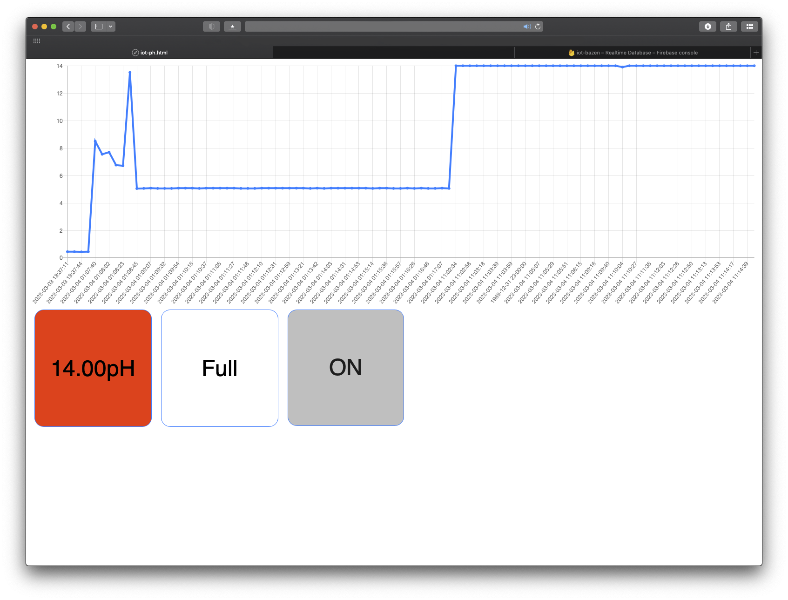

# ph-regulation

## About project 

This project shows how to build automatic ph regulation in pool using arduino.

## Instalation

First install [Arduino IDE](https://www.arduino.cc/en/software)

### Esp installaion 

To install the ESP32 board in your Arduino IDE, follow these next instructions

<ol>
<li>
In your Arduino IDE, go to File> Preferences ( or Arduino IDE > settings on mac)

</li>
<li>
Enter the following into the “Additional Board Manager URLs” field
    
    https://arduino.esp8266.com/stable/package_esp8266com_index.json
 </li>
 <li>
Open the Boards Manager. Go to Tools > Board > Boards Manager…
    

</li>
<li>
Install these two boards

</li>
</ol>

### How to upload code to esp-01 using arduino 

